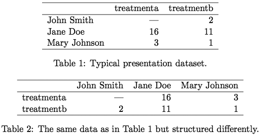
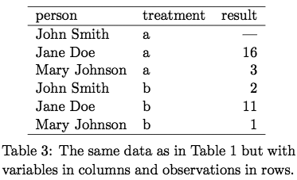
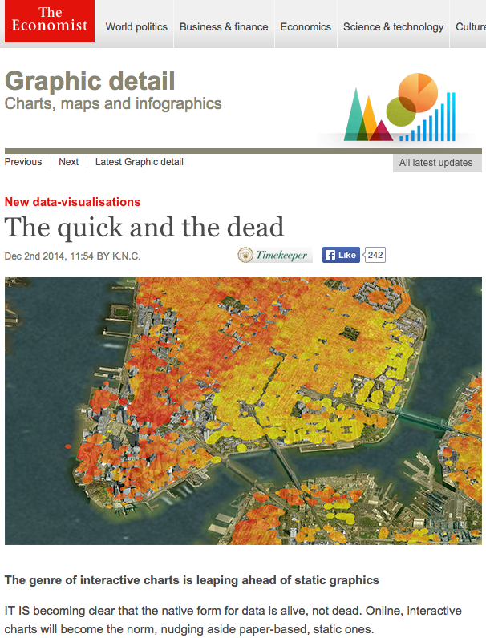

## Intro

You have:
* a working knowledge of R,
* some familiarity with the usage of `ggplot2` (such as what was presented during the [2013](https://github.com/berkeley-scf/r-bootcamp-2013/) or [2014 UC Berkeley SCF/D-Lab R Bootcamp](https://github.com/berkeley-scf/r-bootcamp-2014/)),
* an interest in creating data visualizations in R, both **static** (mostly using *ggplot2*) and **interactive** (using a variety of packages).

---

## Why `ggplot`?

* It's pretty. 
* Its commands are intuitive and "human-readable."
* Nearly any graphic can be created, so you can use it for everything and maintain a consistent style.
* It has (sort of) built-in support for maps.

*** =pnotes

* If you're here, you're probably already using ggplot or are interested in learning to use it. But, I'm still going to tell you why it's a good thing to use.
* Of course, it's pretty. Graphics made with ggplot are eye-catching.  This is actually pretty important -- it goes a long way when you want anyone who is not a statistician to look at your graphs.
* The code you use to call ggplot and create a graphic is fairly intuitive.  This is because of the "grammar of graphics" that it adheres to, and we'll get back to that in a bit. This is what the "gg" in "ggplot" stands for -- "grammar of graphics" -- so the philosophy is pretty central to the package.
* If you learn how to use it well, you can make almost any visualization in it, and your reports, presentations, papers, and so on will look more cohesive because you stuck to a particular style throughout.
* Finally, with a little help from other R packages, ggplot is able to interface with geographical maps.

---

## Why not `ggplot`?

* It's slow.
* It won't do some things.
* There's a steep learning curve.
* ~~`lattice` is better at trellis graphs?~~ [Faceting](https://learnr.wordpress.com/2009/08/26/ggplot2-version-of-figures-in-lattice-multivariate-data-visualization-with-r-final-part/) is just as powerful.


*** =pnotes

* So, what are the arguments against ggplot?
* It's slower than other R graphics systems. This is a fair point. However, it's probably not something you'll notice under everyday use.
* It also won't draw some graphics that you might want it to. One example that's often brought up is 3D surface plots. But, do you really want to make a static 3D perspective plot? There are other, arguably better, ways to represent three-dimensional data in 2D, like contour plots and heatmaps. This is kind of the story with most things that ggplot supposedly "can't" do -- it's a principled decision by a designer to limit the use of his product -- artistic license. For example, having two y-axes, each using a different scale for a different variable, is difficult if not impossible to do in ggplot -- which may be for the best because having two y-axes can be misleading. Moving x-axis labels to the top, rather than the bottom, is difficult but can be done. ggplot also refuses to use more than six shapes -- citing difficultly in determining which is which -- unless you manually override this by specifying your own shapes. 
* ggplot can be difficult to break into. If you force yourself to use it, it will become natural fairly quickly, though. You can also start with qplot aka "quick plot," but I won't be going over that here. 
* Some people argue that lattice is better at trellis graphs, which were made popular by William Cleveland's 1993 book "Visualizing Data." However, I disagree. I've included a link here to a compilation of a series of blog posts from 2009 in which nearly every graphic in the entire Lattice book by Deepayan Sarkar was recreated in ggplot. You can tweak these examples to make them look even more like lattice output, if you want, but the point is that faceting works just as well.

---  &twocol

## Tidy data ^`r Citep(bib, "Wickham_2014", .opts = list(cite.style = "numeric"))`

1. Each variable forms a column.
2. Each observation forms a row.
3. Each type of observational unit forms a table.

*** =left



*** =right



*** =pnotes

* One stumbling block when getting started with ggplot is that your data needs to be in a certain format before you can use it in ggplot effectively.  One name for this format is "tidy data." It can also be called long or tall, as opposed to wide, data, but tidy data is a particular type of long data.  The general idea is that there should be one row per observation, whatever you're calling a single observation for your purposes, and one column per variable.  This means that you're typically going to want to collapse indicators into factors, for example, or you may need to think carefully about what your observational unit is.
* Here, the first two tables display data that is not tidy. The third table displays the same data, but made tidy.

---

## The (Layered) Grammar of Graphics ^(`r Citep(bib, c("Wilkinson_2005", "Wickham_2009", "Wickham_2010"), .opts = list(cite.style = "numeric"))`)

* Move away from using "names" and "chart typologies."
* Instead, use "statements" constructed via grammar
* Why?
    + An infinite number of unique graphics can be created.
    + The implementation is **DRY** ("don't repeat yourself") not **WET** ("write everything twice" or "we enjoy typing").

> "Good grammar is just the first step in creating a good sentence."

> <cite>^`r Citep(bib, "Wickham_2010")`</cite>

*** =pnotes
As I mentioned previously, one of the best qualities of ggplot is that a series of commands used to generate a graphic are human-readable.  This is because ggplot adheres to the so-called "grammar of graphics," first laid out by Leland Wilkinson in 1995. The general idea is, instead of using a "name," "chart typology," or drawing from what Hadley Wickham calls a "big collection of special cases," think more abstractly and use a "statement" to describe a graphic -- and we need a grammar to construct statements. This infinitely expands the number of unique graphics that can be created and it adheres to the **DRY** ("don't repeat yourself") programming principle (as opposed to WET, "write everything twice" or "we enjoy typing")

Hadley Wickham's quote from his 2010 paper on his take grammar of graphics is just meant to say that this is not a recipe for a perfect graphic -- you can still make some pretty poor visualizations with ggplot -- but it is the first step.

---

## Components of the Grammar

Specify a statistical graphic using components of statements:
+ Data (`data`),
+ Statistical transformations (`stat`: identity, count, mean, etc.),
+ Geometric elements/objects (`geom`: points, lines, etc.),
+ Aesthetic mappings (`aes`: color, shape, size, transparency, etc.),
+ Coordinate systems (`coord`: cartesian, polar, map, etc.),
+ Guides/Scales and transformations thereof (`scale`, `guide`, and others: axes, log-transformed scales, legends, etc.), 
+ Faceting/conditioning/latticing/trellising (`facet`), 
+ Tweaking graphical positioning and visual elements (`position`, `theme`, etc.), and
+ Layering.

*** =pnotes

The general concepts or classes, which are kind of a mash-up of Wilkinson's and Wickham's philosophies, are listed here. The realizations of these concepts in `ggplot` are in parentheses so we can connect the ideas to the R commands. Also, layering is not a statement itself, but is implied by the order of the other components.

---

## The anatomy of a `ggplot` command

* All arguments to the main, initial function call, `ggplot`, set graph defaults.
* These defaults can be changed for an individual element (even `data`).

```{r fakeggplot1, eval=FALSE}
ggplot(data=, aes(x=,y=,...)) +
	geom_????(...) +
	...
```
```{r fakeggplot2, eval=FALSE}
ggplot() +
	geom_????(data=, aes(x=,y=,...),...) +
	...
```

*** =pnotes

* Some guides, including the ggplot book, start you off with the qplot or "quick plot" command. That's nice if you're coming from another graphics framework like base graphics in R. But, in the interest of time, because I'm assuming a little bit of familiarity with ggplot with this group, and because the ggplot command is more powerful than qplot, I'm going to skip right to using the ggplot command here.
* These are some simple examples of the ways in which you would create a very simple graph using ggplot. Any aesthetics or data you provide to the ggplot command, which always gets called first in the "statement," set defaults for the entire graph. You can instead choose to leave the ggplot command empty -- without arguments -- if you'd like to specify individual data and aesthetics for each geometric object. You can even specify a defaults AND specify different settings for individual geometric elements. Note that it is best practice to not repeat yourself, so typically you'll set some defaults up front and only change later in the statement any individual elements that you want to change.

---

## The data

* [Kaggle March Machine Learning "Mania" 2015](http://www.kaggle.com/c/march-machine-learning-mania-2015)

```{r loaddata, message=FALSE, cache=FALSE}
source(paste("assets","load_marchmania2015.R", 
	sep=.Platform[["file.sep"]]))
# change this path to the location of your CSVs downloaded from kaggle
# note that required packages will be installed automatically
ncaa.bball = load.clean.summ.ncaa("~/Dropbox/kaggle/marchmania2015")
```

* Alternatively, use data that ships with `ggplot2`: 
    + [diamonds](http://docs.ggplot2.org/current/diamonds.html),
    + [mpg](http://docs.ggplot2.org/current/mpg.html),
    + [movies](http://docs.ggplot2.org/current/movies.html), etc.


*** =pnotes

The dataset I'll be using throughout the presentation is from a Kaggle competition that's currently open. This is historical NCAA basketball data from 1984 to 2014. I'm not allowed to distribute the dataset, but the CSVs are free to download from Kaggle's site after you sign up for an account with them. If you'd like to be able to recreate or play around with the graphics here, that's what you'll need to do. I've included an R file in the repo containing a function called load.clean.ncaa that loads the data into your R workspace and does some minimal cleaning. To use it, just change the argument to the path where the Kaggle CSVs are stored on your machine.  If you don't want to go to this trouble, ggplot2 ships with several good datasets that you can use instead -- a few of them are listed here. You can try your hand with one of those if you want some practice.

---

## A simple scatterplot
```{r simple-scatterplot0, fig.cap=" ", message=FALSE, eval=FALSE}
library(ggplot2)
ggplot(data=ncaa.bball[["games"]], aes(x=lscore, y=wscore)) + 
	geom_point() + 
	xlab("Points scored by losing team") +
	ylab("Points scored by winning team") +
	ggtitle("Final scores of NCAA basketball games\nNovember 1984 - April 2014") +
	theme(text = element_text(size = 16))
```

---

```{r simple-scatterplot1, fig.cap=" ", fig.height=9, fig.width=11.5, dpi=300, fig.align='center', message=FALSE, echo=FALSE, cache=FALSE}
library(ggplot2)
ggplot(data=ncaa.bball[["games"]], aes(x=lscore, y=wscore)) + 
	geom_point() + 
	xlab("Points scored by losing team") +
	ylab("Points scored by winning team") +
	ggtitle("Final scores of NCAA basketball games\nNovember 1984 - April 2014") +
	theme(text = element_text(size = 16))
```

*** =pnotes

* This is a simple example to get us started. Here we have DATA which contains all the NCAA basketball games played over 30 seasons between 1984 and 2014. Each row is an observation, as we've defined it for this problem -- a single basketball game. Each column is a variable. This data is tidy, at least for how we choose to represent it now -- but there are other ways to structure it.
* There are no implicit or explicit transformations of the data going on, and the only aesthetics are the position of each point in two dimensional space, defined by x and y. The geometric objects here are points, which are displayed in ggplot by default as circles. And, because it's just good practice, we've tweaked some visual elements, adding labels to each axis and a title to the graph.
* All that said, this is not a great graphic.  We can tell that, obviously, the winning team always scored as many or more points than the losing team, and it seems like there might be many games where the score was close, but it's difficult to tell because of all the overplotting. I'm not going to dwell too much on what a good versus bad plot is -- you'll know that from other classes, like Professor Dudoit's Computational Statistics course, but I just wanted to point that out here as a segue to the next graphic.

---

## Improving the scatterplot
```{r statbinhex0, fig.cap=" ", eval=FALSE}
library(munsell) # color system used by ggplot2
ggplot(data=ncaa.bball[["games"]], aes(x=lscore, y=wscore)) + 
	# default is bins=c(30,30) 
	# can use scalar when no. of bins for x and y are same.
	# here alternatively specifying binwidth:
	stat_binhex(binwidth=c(4, 4)) + 
	# mnsl converts [hue lightness/color purity] to hex color codes.
	# scale_fill_gradient == scale_fill_continuous.
	scale_fill_gradient("Number of games", trans = "sqrt",
		low=mnsl("7.5G 2/4"), high=mnsl("7.5G 9/6")) +
	xlab("Points scored by losing team") +
	ylab("Points scored by winning team") +
	ggtitle("Final scores of NCAA basketball games\nNovember 1984 - April 2014") +
	theme_classic(base_size = 16)
```

---

```{r statbinhex1, fig.cap=" ", fig.height=9, fig.width=10.5, dpi=300, fig.align='center', message=FALSE, echo=FALSE, cache=FALSE}
library(munsell)
ggplot(data=ncaa.bball[["games"]], aes(x=lscore, y=wscore)) + 
	# default is bins=c(30,30) 
	# can use scalar when no. of bins for x and y are same.
	# here alternatively specifying binwidth:
	stat_binhex(binwidth=c(4, 4)) + 
	# scale_fill_gradient == scale_fill_continuous.
	# the mnsl fxn converts [hue lightness/color purity] to hex color codes.
	scale_fill_gradient("Number of games", trans = "sqrt",
		low=mnsl("7.5G 2/4"), high=mnsl("7.5G 9/6")) +
	xlab("Points scored by losing team") +
	ylab("Points scored by winning team") +
	ggtitle("Final scores of NCAA basketball games\nNovember 1984 - April 2014") +
	theme_classic(base_size = 16)
```

*** =pnotes

Here we are explicitly calling a ggplot transformation that asks ggplot to hexagonally bin, in two dimensions, our observations. Here we're telling it to create bins of width 4 points for both x and y. The default is actually specified as binwidth, not number of bins, and it is 30 for both. The geometric objects, hexagons, are implied by this statement. Whenever you allow ggplot to transform your data, you should always know what it's doing -- here I'm careful to state the defaults and changed them just to demonstrate how it can be done.  This is one tricky part about using a "smart" graphics package -- you need to be sure to keep up with what it's doing to your data.  There was a job talk recently that I know some of you attended which was really amazing for the most part -- really advanced theory and good discussion -- but it was completely derailed for a good 5 minutes by discussion over a single graphic, which was made in ggplot, and which wasn't even demonstrating a main point of the talk.  The big issues were that there were several geometric objects drawn on the graph, and a couple of them performed transformations on the data, but it wasn't made clear exactly what those transformations were.  It's easy to use some of these functions without thinking very hard about them, particularly if you leave them at their default settings, but you really need to be careful.  That's why I'm showing this plot with the "stat_binhex" first, so that it's clear there's a transformation happening.  However...

---

## Improving the scatterplot
```{r geomhex0, fig.cap=" ", message=FALSE, eval=FALSE}
ggplot(data=ncaa.bball[["games"]], aes(x=lscore, y=wscore)) + 
	# default is bins=c(30,30) 
	# can use scalar when no. of bins for x and y are same.
	# here alternatively specifying binwidth:
	geom_hex(stat = "binhex", binwidth=c(4,4)) + 
	# scale_fill_gradient == scale_fill_continuous.
	# the mnsl fxn converts [hue lightness/color purity] to hex color codes.
	scale_fill_gradient("Number of games", trans = "sqrt",
		low=mnsl("7.5G 2/4"), high=mnsl("7.5G 9/6")) +
	xlab("Points scored by losing team") +
	ylab("Points scored by winning team") +
	ggtitle("Final scores of NCAA basketball games\nNovember 1984 - April 2014") +
	theme_classic(base_size = 16)
```

---

```{r geomhex1, fig.cap=" ", fig.height=9, fig.width=10.5, dpi=300, fig.align='center', message=FALSE, echo=FALSE, cache=FALSE}
ggplot(data=ncaa.bball[["games"]], aes(x=lscore, y=wscore)) + 
	# default is bins=c(30,30) 
	# can use scalar when no. of bins for x and y are same.
	# here alternatively specifying binwidth:
	geom_hex(stat = "binhex", binwidth=c(4,4)) + 
	# scale_fill_gradient == scale_fill_continuous.
	# the mnsl fxn converts [hue lightness/color purity] to hex color codes.
	scale_fill_gradient("Number of games", trans = "sqrt",
		low=mnsl("7.5G 2/4"), high=mnsl("7.5G 9/6")) +
	xlab("Points scored by losing team") +
	ylab("Points scored by winning team") +
	ggtitle("Final scores of NCAA basketball games\nNovember 1984 - April 2014") +
	theme_classic(base_size = 16)
```

*** =pnotes

As you can see, this produces the same graph. However, now I'm using a call to a "geom" which has a defualt statistical transformation (as opposed to a stat with a default geom). I've explicitly stated the default here for clarity, which is called "binhex," or hexagonal binning of observations to form counts.

---

## When geoms transform

geom               | stat               | modifiable defaults
------------------ | ------------------ | -------------------
`geom_boxplot()`   | `stat_boxplot()`   | max length of whiskers (beyond hinges) = 1.5*IQR
`geom_bar()`       | `stat_bin()`       | 30 bins: binwidth = [range of x]/30
`geom_histogram()` | `stat_bin()`       | 30 bins: binwidth = [range of x]/30
`geom_freqpoly()`  | `stat_bin()`       | 30 bins: binwidth = [range of x]/30
`geom_dotplot()`   | `stat_bindot()`    | 30 bins: binwidth = [range of x]/30; "dotdensity" method
`geom_bin2d()`     | `stat_bin2d()`     | 30 bins for each of x and y
`geom_hex()`       | `stat_binhex()`    | 30 bins for each of x and y (calls `hexbin::hexBin()`)
`geom_density2d()` | `stat_density2d()` | Gaussian kernel; bandwidths (x and y) set by Silverman's "rule of thumb"; 100 grid points for x and y (calls `MASS::kde2d()`)
`geom_density()`   | `stat_density()`   | Gaussian kernel; bandwidth set by Silverman's "rule of thumb" (calls `stats::density()`)
`geom_violin()`    | `stat_ydensity()`  | Gaussian kernel; bandwidth set by Silverman's "rule of thumb" (calls `stats::density()`); all violins have same area before trimming tails, tails are trimmed to [range of y]
`geom_smooth()`    | `stat_smooth()`    | if n<1000, `stats::loess()` with polynomial degree 2, $\alpha=0.75$, etc.; else, `gam::gam()` with penalized cubic regression splines, etc.; 80 evaluation points
`geom_quantile()`  | `stat_quantile()`  | 3 quartiles; "br" method (modified Barrodale & Roberts method; calls `quantreg::rq()`)
`geom_contour()`   | `stat_contour()`   | 10 `pretty` breakpoints covering [range of z]

*** =pnotes

* Here is a reference list of the geometric elements in ggplot that "silently" transform data by default, i.e. their default stat is not "identity. Also listed here are the defaults of those transformations. Although I called a "stat" function earlier that, by default, created a "geom", it is much more common in practice to just call a "geom" and add arguments specifying the "stat".
* The boxplot is a special case where many elements cannot be set by the user, but that's alright because they're what you'd expect them to be. The middle line is the median and the lower and upper hinges represent the lower and upper quartiles, respectively. The one thing you can specify is how far - at a maximum - the whiskers extend beyond the hinges, but the default (1.5 x inter-quartile range) is consistent with John Tukey's boxplot. You can also make a notched boxplot with geom_boxplot, and the notch locations are not specifiable, but I won't go into the settings for that here -- you can find it in the documentation if you're interested.
* For one and two dimensional kernel density estimates, by default, the bandwidth is chosen automatically via Silverman's "rule of thumb," which I won't go into here, but the formula is available in the R help via the functions I've listed here, or on Wikipedia if you search for Silverman's "rule of thumb." Essentially it's the optimal bandwidth if your data's underlying distribution is Gaussian.
* For loess and gam I only listed the most interesting parameters -- there are more that you can set. Just know that the "et cetera" indicates that any defaults not listed here for these functions are not modified in ggplot's call.
* FYI, violin plots were the big culprit for derailing the job talk a few weeks ago. As you can see, they're a bit tricky.

---

## Other `ggplot` transformations

* `stat_ecdf`: Empirical Cumulative Density Function
* `stat_function`: Superimpose a function.
* `stat_qq`: Calculation for quantile-quantile plot.
* `stat_spoke`: Convert angle and radius to xend and yend.
* `stat_sum`: Sum unique values. Useful for overplotting on scatterplots.
* `stat_summary`: Summarise y values at every unique x.
* `stat_summary_hex`: Apply funciton for 2D hexagonal bins.
* `stat_summary2d`: Apply function for 2D rectangular bins.
* `stat_unique`: Remove duplicates.
* `stat_identity`

---

## A heatmap with `geom_tile`

```{r heatmap0, results='asis', message=FALSE, eval=FALSE}
library(RColorBrewer) # brewer.pal
library(grid)         # unit
tourney.teams.2014 = as.character(
	unique(subset(ncaa.bball[["team.season.summ"]],
		(season==2014)&(max.tourney.round>="Sweet Sixteen"))$team.name))
p = ggplot(subset(ncaa.bball[["team.season.summ"]], 
		team.name%in%tourney.teams.2014),
		aes(x=season, y=team.name, fill=win.pct)) +
	geom_tile() + 
	scale_fill_gradientn(
		"Proportion of regular season games won",
		colours = brewer.pal(9,"GnBu")[3:9],
		na.value="grey80", breaks=seq(0,1,0.25),
		guide = guide_colorbar(barwidth = 15, barheight = 1)) +
	scale_x_continuous("Season", expand = c(0, 0)) + 
	scale_y_discrete("Team", expand = c(0, 0)) +
	ggtitle("Historical regular season performance of\n2014 NCAA tournament 'Sweet 16' teams") +
	theme_classic(base_size=16) + 
	theme(legend.position = "bottom",
		axis.text.y = element_text(size = 11),
		plot.margin = unit(c(0,0.1,-0.4,0.1), "cm"))
p
```

---

```{r heatmap1, fig.cap=" ", fig.height=9, fig.width=10.5, dpi=300, fig.align='center', message=FALSE, echo=FALSE, cache=FALSE}
library(RColorBrewer) # brewer.pal
library(grid)         # unit
tourney.teams.2014 = as.character(
	unique(subset(ncaa.bball[["team.season.summ"]],
		(season==2014)&(max.tourney.round>="Sweet Sixteen"))$team.name))
p = ggplot(subset(ncaa.bball[["team.season.summ"]], 
		team.name%in%tourney.teams.2014),
		aes(x=season, y=team.name, fill=win.pct)) +
	geom_tile() + 
	scale_fill_gradientn(
		"Proportion of regular season games won",
		colours = brewer.pal(9,"GnBu")[3:9],
		na.value="grey80", breaks=seq(0,1,0.25),
		guide = guide_colorbar(barwidth = 15, barheight = 1)) +
	scale_x_continuous("Season", expand = c(0, 0)) + 
	scale_y_discrete("Team", expand = c(0, 0)) +
	ggtitle("Historical regular season performance of\n2014 NCAA tournament 'Sweet 16' teams") +
	theme_classic(base_size=16) + 
	theme(legend.position = "bottom",
		axis.text.y = element_text(size = 11),
		plot.margin = unit(c(0,0.1,-0.4,0.1), "cm"))
p
```

*** =pnotes

Note that there is a package called `gplots` with a function called `heatmap.2`: this is commonly used to make heatmaps with dendrograms but is not the same as `ggplot`.

---

## Adding a dendrogram to the heatmap

---

## Dates, `tidyr`, and summaries with `ggplot2`

```{r datescaleduke0, results='asis', message=FALSE, eval=FALSE}
library(tidyr) # gather
duke.2014 = subset(ncaa.bball[["teams"]], 
		(season==2014)&(team.name=="Duke"))[,
		c("date","fg.pct","fg3.pct","ft.pct","result")] %>%
	tidyr::gather(shot.type, pct, -c(date, result))

library(scales) # date_format
ggplot(duke.2014, aes(x=date, y=pct, color=shot.type)) +
	geom_line() +
	geom_line(stat = "hline", yintercept = "mean",
		linetype="dashed", alpha=0.65) +
	geom_rug(data=subset(duke.2014,(result=="Loss")&(shot.type=="fg.pct")), 
		sides="b", color="grey20") +
	scale_x_datetime("Game date", labels = date_format("%b %Y")) +
	ylab("Proportion of shots made") +
	scale_color_discrete("Type of shot", 
		labels=c("two point field goal","three point field goal","free throw")) +
	ggtitle("Duke's per-game shot percentages, 2013-14 season:\nbottom ticks indicate losses; dashed lines are season averages") +
	theme_classic(base_size = 16) + theme(legend.position = "bottom")
```

---

```{r datescaleduke1, fig.cap=" ", fig.height=9, fig.width=10.5, dpi=300, fig.align='center', message=FALSE, echo=FALSE, cache=FALSE}
library(tidyr) # gather
duke.2014 = subset(ncaa.bball[["teams"]], 
		(season==2014)&(team.name=="Duke"))[,
		c("date","fg.pct","fg3.pct","ft.pct","result")] %>%
	tidyr::gather(shot.type, pct, -c(date, result))

library(scales) # date_format
ggplot(duke.2014, aes(x=date, y=pct, color=shot.type)) +
	geom_line() +
	geom_line(stat = "hline", yintercept = "mean",
		linetype="dashed", alpha=0.65) +
	geom_rug(data=subset(duke.2014,(result=="Loss")&(shot.type=="fg.pct")), 
		sides="b", color="grey20") +
	scale_x_datetime("Game date", labels = date_format("%b %Y")) +
	ylab("Proportion of shots made") +
	scale_color_discrete("Type of shot", 
		labels=c("two point field goal","three point field goal","free throw")) +
	ggtitle("Duke's per-game shot percentages, 2013-14 season:\nbottom ticks indicate losses; dashed lines are season averages") +
	theme_classic(base_size = 16) + theme(legend.position = "bottom")
```

--- &twocol

## Packages that pair well with `ggplot2`

*** =left

- [grid](https://stat.ethz.ch/R-manual/R-devel/library/grid/html/00Index.html)
- [gridExtra](http://cran.r-project.org/web/packages/gridExtra/index.html): additional functions to tweak/manipulate grid graphics
- [scales](http://cran.r-project.org/web/packages/scales/index.html): additional functions to deal with the `scale` portions of the grammar of graphics
- [gtable](http://cran.r-project.org/web/packages/gtable/index.html): use to dismantle/hack underlying table of Grid Graphical Objects (grobs) that make up a `ggplot`
- [ggsubplot](http://cran.r-project.org/web/packages/ggsubplot/index.html): embed smaller subplots within larger plots, all using `ggplot2` graphics
- [dplyr](http://cran.r-project.org/web/packages/dplyr/index.html) (or [plyr](http://cran.r-project.org/web/packages/plyr/index.html)): manipulate data
- [tidyr](http://cran.r-project.org/web/packages/tidyr/index.html) (or [reshape2](http://cran.r-project.org/web/packages/reshape2/index.html)): restructure data (esp. wide $\leftrightarrow$ long)
- [lubridate](http://cran.r-project.org/web/packages/lubridate/index.html): "makes working with dates fun instead of frustrating"
- [devtools](http://cran.r-project.org/web/packages/devtools/index.html): R package development tools (esp. ability to install packages from github rather than CRAN)

*** =right

- [ggthemes](http://cran.r-project.org/web/packages/ggthemes/index.html), [xkcd](http://cran.r-project.org/web/packages/xkcd/index.html): for when you don't want your `ggplot` to look so much like a `ggplot`
- [extrafont](http://cran.r-project.org/web/packages/extrafont/index.html), [RColorBrewer](http://cran.r-project.org/web/packages/RColorBrewer/index.html), [munsell](http://cran.r-project.org/web/packages/munsell/index.html), https://github.com/karthik/wesanderson : custom fonts and color schemes
- [ggdendro](http://cran.r-project.org/web/packages/ggdendro/index.html): dendrograms and trees with `ggplot2`
- [GGally](http://cran.r-project.org/web/packages/GGally/index.html): plot matrices (as in `graphics::pairs`), parallel coordinate plots, and network plots with `ggplot2`
- [ggtern](http://cran.r-project.org/web/packages/ggtern/index.html): ternary plots (as in `vcd::ternaryplot`) and other additional *geom*s for `ggplot2`.
- [ggmap](http://cran.r-project.org/web/packages/ggmap/index.html), [maps](http://cran.r-project.org/web/packages/maps/index.html), [maptools](http://cran.r-project.org/web/packages/maptools/index.html), [sp](http://cran.r-project.org/web/packages/sp/index.html), [rgdal](http://cran.r-project.org/web/packages/rgdal/index.html), [RgoogleMaps](http://cran.r-project.org/web/packages/RgoogleMaps/index.html): maps with `ggplot2`
- [ggHorizon](http://cran.r-project.org/web/packages/ggHorizon/index.html) horizon graphs with `ggplot2` ([example 1](http://www.perceptualedge.com/articles/visual_business_intelligence/time_on_the_horizon.pdf), [example 2](http://vis.berkeley.edu/papers/horizon/2009-TimeSeries-CHI.pdf))
- $\ldots$

*** =pnotes

* The examples for ggsubplot are a little "busy" but it actually can be useful in practice.  For example, if you want to zoom in on a particular part of a plot and show it as an inset, or show an inset of what a particular graph would look like under conditions like the null, and so on.
* Note that the munsell color system is what is used by ggplot by default, but you may want to use the same color system to make your own palettes.

* tidyr: http://blog.rstudio.org/2014/07/22/introducing-tidyr/ http://www.rstudio.com/wp-content/uploads/2015/02/data-wrangling-cheatsheet.pdf
stringr?
profr?

grid: unit, viewport
ggthemes theme_few() + scale_colour_few()

---

## Where to go for help with `ggplot2`

* [Hadley Wickham's ggplot2 book (2009)](http://link.springer.com/book/10.1007%2F978-0-387-98141-3)
* [companion website to the book](http://ggplot2.org/book/)
* [official documentation](http://docs.ggplot2.org/current/)
* [google group](https://groups.google.com/forum/#!forum/ggplot2)
* [ggplot2 on stackoverflow](http://stackoverflow.com/tags/ggplot2/info)

---

# Interactive data visualizations in R

--- &twocol

## Why interactive?

*** =left

- They're pretty, fun, and people love them (see [Hans Rosling's TED talks](https://www.ted.com/speakers/hans_rosling)).
- They allow you to engage with, explore, and discover more about your data -- visually.
- Static graphics are "dead" (according to The Economist).

*** =right



---

## SVG `ggplot` with `plotly`

```{r plotly0static, results='asis', message=FALSE, eval=FALSE}
# start with a static ggplot
p = ggplot(subset(ncaa.bball[["team.season.summ"]], 
		max.tourney.round>="Sweet Sixteen"),
	aes(x=season, y=win.pct, color=max.tourney.round)) +
	# ideally we would jitter here, but plotly has trouble with this
	# geom_point(position = position_jitter(w = 0.4, h = 0.002)) +
	geom_point(size=3, alpha=0.7) + # instead use transparency
	xlab("Year") + 
	ylab("Proportion of regular season games won") +
	scale_color_discrete("Highest tournament round achieved") +
	ggtitle("Regular season performance of 'Sweet Sixteen' teams 1985-2014, by season") +
	theme_classic(base_size = 16) + theme(legend.position = "bottom")
p
```

---

```{r plotly1static, fig.cap=" ", fig.height=9, fig.width=10.5, dpi=300, fig.align='center', message=FALSE, echo=FALSE, cache=FALSE}
p = ggplot(subset(ncaa.bball[["team.season.summ"]], 
		max.tourney.round>="Sweet Sixteen"),
	aes(x=season, y=win.pct, color=max.tourney.round)) +
	# ideally we would jitter here, but plotly has trouble with this
	# geom_point(position = position_jitter(w = 0.4, h = 0.002)) +
	geom_point(size=3, alpha=0.7) + # instead use transparency
	xlab("Year") + 
	ylab("Proportion of regular season games won") +
	scale_color_discrete("Highest tournament round achieved") +
	ggtitle("Regular season performance of 'Sweet 16' teams 1985-2014, by season") +
	theme_classic(base_size = 16) + theme(legend.position = "bottom")
p
```

---

## SVG `ggplot` with `plotly`

```{r plotly0, results='asis', message=FALSE, eval=FALSE}
# library(devtools)
# install_github("ropensci/plotly")
library(plotly)

# get a plot.ly account and get your api key here:
# https://plot.ly/settings/api
# plug it in with your username in the statement below.
# set_credentials_file("username", "xxxxxxxxxx")

py <- plotly()
# recall p is the object returned by ggplot
# plot.info = py$ggplotly(p) # in an R session, opens in browser
plot.info = py$ggplotly(p, session="knitr") # embed in knitr document
# if you're embedding in a knitr document, 
# be sure to also set the code chunk
# plotly=TRUE
```

---

```{r plotly1, results='asis', message=FALSE, echo=FALSE, plotly=TRUE}
library(plotly)
py <- plotly()
plot.info = py$ggplotly(p, session="knitr") # embed in knitr document
```

*** =pnotes

* Note that graphics are uploaded to plot.ly and are **public** by default. So, don't use this unless you're ok with other people seeing it.
* Also, the conversion does not always go as planned.  Sometimes the ggplotly function will reject the ggplot object with a cryptic error message. Sometimes it will convert it, but it will not look sensible. The tooltips are also not as helpful as they could be -- but there are apparently cumbersome ways to hack them. Your mileage may vary.

---

## SVG graphic with `clickme`

```{r clickme0, results='asis', message=FALSE, eval=FALSE}
# library(devtools)
# install_github("nachocab/clickme")
library(clickme)
cmplot = with(subset(ncaa.bball[["team.season.summ"]], 
		max.tourney.round>="Sweet Sixteen"),
	clickme("points",
	    x = season, y = win.pct,
	    names = team.name,
	    color_groups = as.character(max.tourney.round),
	    x_title = "Year", x_format = "",
	    y_title = "Proportion of regular season games won",
	    color_title = "Highest tournament round achieved",
	    color_group_order = levels(max.tourney.round)[4:8],
	    title = "Regular season performance of 'Sweet 16' teams",
	    subtitle = "1985-2014, by season",
	    file_path = paste(getwd(),"clickme0.html", 
	    	sep=.Platform$file.sep),
	    height = 600, width = 700))
# cmplot # in an R session, open in browser
# embed in knitr document:
cmplot$iframe(relative_path = getwd())$hide()
```

---

```{r clickme1, results='asis', message=FALSE, echo=FALSE}
library(clickme)
cmplot = with(subset(ncaa.bball[["team.season.summ"]], 
		max.tourney.round>="Sweet Sixteen"),
	clickme("points",
	    x = season, y = win.pct,
	    names = team.name,
	    color_groups = as.character(max.tourney.round),
	    x_title = "Year", x_format = "",
	    y_title = "Proportion of regular season games won",
	    color_title = "Highest tournament round achieved",
	    color_group_order = levels(max.tourney.round)[4:8],
	    title = "Regular season performance of 'Sweet 16' teams",
	    subtitle = "1985-2014, by season",
	    file_path = paste(getwd(),"clickme0.html", 
	    	sep=.Platform$file.sep),
	    height = 600, width = 700))
# cmplot # in an R session, open in browser
# embed in knitr document:
cmplot$iframe(relative_path = getwd())$hide()
```

---

## MotionChart with `googleVis` (Flash)

```{r googlevis0, results='asis', message=FALSE, eval=FALSE}
library(googleVis)
# data.frame with >=4 cols: x, y, id, time. color and size optional,
# but if you don't provide them, 
# it will choose them for you (if there are columns left to use)
mc = gvisMotionChart(
	subset(ncaa.bball[["team.season.summ"]], 
		!is.na(tourney.seed))[,c("team.name", "season", "win.pct", 
			"points.avg", "mov.avg", "tourney.seed")],
	idvar="team.name", timevar="season", 
	xvar="win.pct", yvar="tourney.seed",
	sizevar="mov.avg", colorvar="points.avg",
	options=list(width=750, height=650))
# plot(mc) # in an R session, opens in browser
print(mc, 'chart') # embed in knitr document
```

---

```{r googlevis1, results='asis', message=FALSE, echo=FALSE, cache=FALSE}
library(googleVis)
# data.frame with >=4 cols: x, y, id, time. color and size optional,
# but if you don't provide them, 
# it will choose them for you (if there are columns left to use)
mc = gvisMotionChart(
	subset(ncaa.bball[["team.season.summ"]], 
		!is.na(tourney.seed))[, c("team.name", "season", "win.pct", 
			"points.avg", "mov.avg", "tourney.seed")],
	idvar="team.name", timevar="season", 
	xvar="win.pct", yvar="tourney.seed",
	sizevar="mov.avg", colorvar="points.avg",
	options=list(width=750, height=650))
# plot(mc) # in an R session, opens in browser
print(mc, 'chart') # embed in knitr document
```

*** =pnotes
"The googleVis package provides an interface between R and the Google Charts API. Google Charts offer interactive charts which can be embedded into web pages. The best known of these charts is probably the Motion Chart, popularised by Hans Rosling in his TED talks.
The functions of the googleVis package allow the user to visualise data stored in R data frames with Google Charts without uploading the data to Google. The output of a googleVis function is html code that contains the data and references to JavaScript functions hosted by Google."

--- &twocol

## Many interactive options in R

*** =left

- [plotly](https://github.com/ropensci/plotly): `ggplot2` graphics $\rightarrow$ SVG via [plot.ly's R API](https://plot.ly/r/)
- [googleVis](http://cran.r-project.org/web/packages/googleVis/index.html): R interface to Google Charts API; SVG and Flash
- [rCharts](https://github.com/ramnathv/rCharts): SVG graphics with popular JS libs, directly from R
- [ggvis](http://cran.r-project.org/web/packages/ggvis/index.html): SVG and HTML5 Canvas graphics, rendered using [vega](http://trifacta.github.io/vega/), declared in a "grammar of graphics" style similar to `ggplot2`
- [gridSVG](http://cran.r-project.org/web/packages/gridSVG/index.html): `ggplot2` and `lattice` graphics $\rightarrow$ SVG image

*** =right

- [clickme](https://github.com/nachocab/clickme): interactive SVG graphics from R
- [rMaps](https://github.com/ramnathv/rMaps): interactive maps with popular JS libs, directly from R
- [networkD3](http://github.com/christophergandrud/networkD3/): [d3.js](http://d3js.org/) network graphs from R (SVG)
- [rgl](http://cran.r-project.org/web/packages/rgl/index.html): interactive 3D visualizations using OpenGL and other frameworks/formats ([example](https://dl.dropboxusercontent.com/u/15335397/misc/webgl-rmd.html))
- [rggobi](http://cran.r-project.org/web/packages/rggobi/index.html): R interface to [GGobi](http://www.ggobi.org/), a "data visualization system" separate from R
- [SVGAnnotation](http://bioconductor.org/packages/release/extra/html/SVGAnnotation.html): used for "post-processing SVG plots created in R"

*** =pnotes

* I'm only listing R packages that are currently available to download and use, appear to be actively maintained and haven't been subsumed by other R packages, produce graphics that can viewed in a web browser locally or embedded in an html document like this one that was produced with knitr and rmarkdown. I'm not going to list anything that requires server-side support from interfaces like Shiny or Rook to be interactive, for example. Whether or not SVGAnnotation is actively maintained is questionable, but I listed it anyway because it's still referenced by people, it does seem to offer some unique features, and one of the two developers on it was Deborah Nolan who is right here at Berkeley.
* Many of these produce graphics in SVG, or Scalable Vector Graphics, which is, according to wikipedia, an XML-based vector image format for 2D graphics with support for interactivity and animation.  Not all of them do, though -- for example, googleVis produces some output as Flash.
* Paul Murrell, who wrote grid, the backbone of both ggplot2 and lattice, also wrote gridSVG, along with one of his students, Simon Potter.
* [tabplotd3](http://cran.r-project.org/web/packages/tabplotd3/index.html): interactive tableplots (see [tabplot](http://cran.r-project.org/web/packages/tabplot/index.html)) - but needs to be served by [Rook](http://cran.r-project.org/web/packages/Rook/index.html)?
* rCharts
    + https://github.com/ramnathv/user2014-rcharts
    + http://zevross.com/blog/2014/04/03/interactive-visualization-from-r-to-d3-using-rcharts/
    + http://timelyportfolio.blogspot.com/2013/04/d3-r-with-rcharts-and-slidify.html
* gridSVG
    + http://timelyportfolio.github.io/gridSVG_intro/
    + http://stackoverflow.com/questions/23852753/knitr-with-gridsvg

---

# Questions?

---

## References

```{r printbib, results="asis", echo=FALSE, cache=FALSE}
PrintBibliography(bib, .opts = list(check.entries = FALSE, sorting = "ynt"))
```

---

## Credits

#### Built using [slidify](https://github.com/ramnathv/slidify) with
+ [knitr](http://cran.r-project.org/web/packages/knitr/index.html),
+ the [deck.js](https://github.com/imakewebthings/deck.js) framework,
+ the [RefManageR](http://cran.r-project.org/web/packages/RefManageR/index.html) bibliography manager, and
+ the [prettify](https://code.google.com/p/google-code-prettify/) syntax highlighter.
